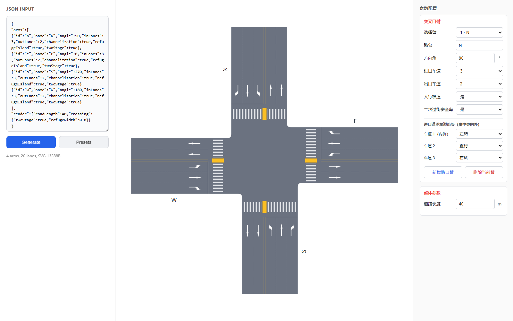
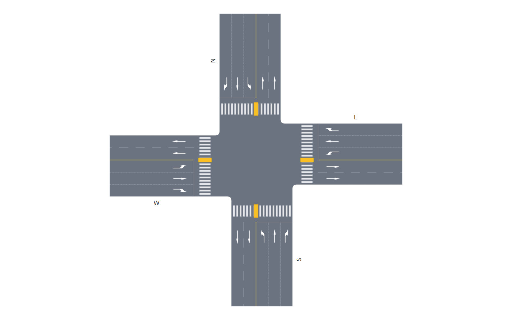
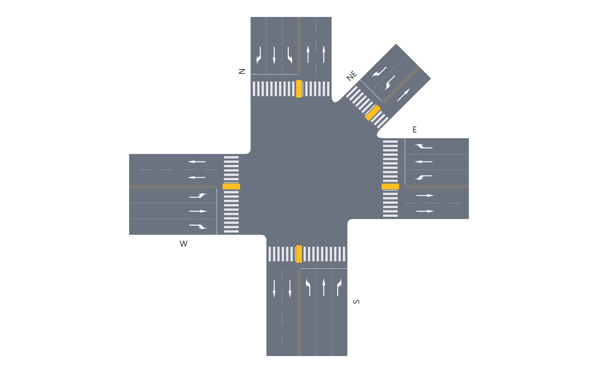

# Intersection Designer

[中文](#中文) | [English](#english)

## 预览 / Preview

### 操作界面 / User Interface



### 路口示例 / Intersection Examples

| 四岔路口 / Four-way intersection | 五岔路口 / Five-way intersection |
| --- | --- |
|  |  |

## 中文

### 项目简介

Intersection Designer 是一个基于浏览器的道路交叉口平面图设计工具。通过右侧参数面板或 JSON 配置，可以快速生成 T 型、十字形、多岔及不规则角度交叉口，并使用 SVG 实时渲染。

### 功能特性

- 支持 2 个及以上路口臂，可配置任意方向角
- 每个路口臂可独立设置进口车道数、出口车道数和路名
- 支持逐条进口车道配置转向箭头
- 自动为出口车道生成直行箭头
- 支持人行横道和二次过街安全岛
- 自动生成停止线、车道虚线、双黄线和路口圆角
- 斑马线条块尺寸固定，并根据道路宽度自动增减数量
- 路口中心范围和斑马线位置根据几何关系自动调整
- 参数面板与 JSON 配置实时同步
- 内置四岔口、T 型口、非对称路口、五岔口和不规则路口预设
- 使用纯 HTML、CSS 和 JavaScript，无需安装依赖或执行构建

### 快速开始

克隆仓库：

```bash
git clone https://github.com/chuzaw/intersection-designer.git
cd intersection-designer
```

直接用浏览器打开 `index.html` 即可使用。也可以下载仓库 ZIP，解压后双击 `index.html`。

建议使用较新版本的 Chrome、Edge 或 Firefox。

### 使用方法

在右侧参数面板中选择一个路口臂，然后配置：

- 路名和方向角
- 进口车道数和出口车道数
- 是否设置人行横道
- 是否设置二次过街安全岛
- 每条进口车道的转向箭头

整体参数中可以修改道路长度。修改选项后，图形和左侧 JSON 会自动更新。

也可以直接编辑左侧 JSON，点击 **Generate** 或按 `Ctrl + Enter` 重新生成图形。

### JSON 配置示例

```json
{
  "arms": [
    {
      "id": "n",
      "name": "人民路",
      "angle": 90,
      "inLanes": 3,
      "outLanes": 2,
      "crosswalk": true,
      "twoStage": true,
      "inLaneArrows": ["左转", "直行", "右转"]
    },
    {
      "id": "e",
      "name": "建设路",
      "angle": 0,
      "inLanes": 3,
      "outLanes": 2,
      "crosswalk": true,
      "twoStage": false,
      "inLaneArrows": ["掉头", "直右", "右转"]
    },
    {
      "id": "s",
      "name": "解放路",
      "angle": 270,
      "inLanes": 3,
      "outLanes": 2,
      "crosswalk": true,
      "twoStage": true,
      "inLaneArrows": ["左转", "直行", "右转"]
    },
    {
      "id": "w",
      "name": "中山路",
      "angle": 180,
      "inLanes": 3,
      "outLanes": 2,
      "crosswalk": true,
      "twoStage": false,
      "inLaneArrows": ["左转", "直行", "右转"]
    }
  ],
  "render": {
    "roadLength": 40,
    "crossing": {
      "refugeWidth": 0.8
    }
  }
}
```

### 主要参数

| 参数 | 类型 | 说明 |
| --- | --- | --- |
| `id` | String | 路口臂唯一标识 |
| `name` | String | 显示在道路外侧的路名 |
| `angle` | Number | 路口臂方向角，单位为度 |
| `inLanes` | Number | 进口车道数 |
| `outLanes` | Number | 出口车道数 |
| `crosswalk` | Boolean | 是否生成人行横道 |
| `twoStage` | Boolean | 是否生成二次过街安全岛 |
| `inLaneArrows` | Array | 从中央分隔线向道路外侧排列的进口道箭头 |
| `render.roadLength` | Number | 道路显示长度，单位为米 |

支持的进口道箭头：

```text
左转、直行、右转、直左、直右、左右、掉头、左掉头、直掉头、none
```

其中 `none` 表示不显示箭头。

### 项目结构

```text
intersection-designer/
├── images/             # 车道箭头图片
├── src/
│   ├── vec2.js         # 二维向量和直线求交
│   ├── model.js        # 路口臂数据模型
│   ├── geometry.js     # 道路与交叉口几何计算
│   └── renderer.js     # SVG 渲染
├── index.html          # 页面、参数面板和交互逻辑
└── README.md
```

---

## English

### Overview

Intersection Designer is a browser-based tool for creating plan-view road intersection diagrams. It generates T-junctions, four-way intersections, multi-arm intersections, and irregular layouts from an interactive control panel or JSON configuration, with real-time SVG rendering.

### Features

- Supports two or more intersection arms at arbitrary angles
- Configurable road name and inbound/outbound lane counts for each arm
- Per-lane turn-arrow configuration for inbound lanes
- Automatic straight-ahead arrows for outbound lanes
- Crosswalks and two-stage pedestrian refuge islands
- Automatic stop lines, dashed lane markings, double yellow lines, and rounded corners
- Fixed-size crosswalk blocks with an automatically adjusted block count
- Geometry-aware intersection center and crosswalk placement
- Real-time synchronization between the control panel and JSON
- Built-in presets for four-way, T-shaped, asymmetric, five-way, and irregular intersections
- Pure HTML, CSS, and JavaScript with no build step or dependencies

### Quick Start

Clone the repository:

```bash
git clone https://github.com/chuzaw/intersection-designer.git
cd intersection-designer
```

Open `index.html` directly in a web browser. Alternatively, download the repository as a ZIP file, extract it, and double-click `index.html`.

A recent version of Chrome, Edge, or Firefox is recommended.

### Usage

Select an intersection arm from the control panel on the right, then configure:

- Road name and direction angle
- Inbound and outbound lane counts
- Crosswalk visibility
- Two-stage pedestrian refuge island
- Turn arrow for each inbound lane

The road length can be changed under the global settings. The diagram and JSON are updated automatically whenever a setting changes.

You can also edit the JSON directly. Click **Generate** or press `Ctrl + Enter` to rebuild the diagram.

### JSON Configuration Example

```json
{
  "arms": [
    {
      "id": "n",
      "name": "Renmin Road",
      "angle": 90,
      "inLanes": 3,
      "outLanes": 2,
      "crosswalk": true,
      "twoStage": true,
      "inLaneArrows": ["左转", "直行", "右转"]
    },
    {
      "id": "e",
      "name": "Jianshe Road",
      "angle": 0,
      "inLanes": 3,
      "outLanes": 2,
      "crosswalk": true,
      "twoStage": false,
      "inLaneArrows": ["掉头", "直右", "右转"]
    },
    {
      "id": "s",
      "name": "Jiefang Road",
      "angle": 270,
      "inLanes": 3,
      "outLanes": 2,
      "crosswalk": true,
      "twoStage": true,
      "inLaneArrows": ["左转", "直行", "右转"]
    },
    {
      "id": "w",
      "name": "Zhongshan Road",
      "angle": 180,
      "inLanes": 3,
      "outLanes": 2,
      "crosswalk": true,
      "twoStage": false,
      "inLaneArrows": ["左转", "直行", "右转"]
    }
  ],
  "render": {
    "roadLength": 40,
    "crossing": {
      "refugeWidth": 0.8
    }
  }
}
```

Arrow values remain in Chinese because they map directly to the image asset filenames used by the renderer.

### Main Parameters

| Parameter | Type | Description |
| --- | --- | --- |
| `id` | String | Unique identifier for the intersection arm |
| `name` | String | Road name displayed beside the road |
| `angle` | Number | Arm direction angle in degrees |
| `inLanes` | Number | Number of inbound lanes |
| `outLanes` | Number | Number of outbound lanes |
| `crosswalk` | Boolean | Whether to generate a crosswalk |
| `twoStage` | Boolean | Whether to generate a two-stage refuge island |
| `inLaneArrows` | Array | Inbound-lane arrows ordered from the median outward |
| `render.roadLength` | Number | Displayed road length in meters |

Supported inbound-arrow values:

```text
左转, 直行, 右转, 直左, 直右, 左右, 掉头, 左掉头, 直掉头, none
```

Use `none` to hide the arrow for a lane.

### Project Structure

```text
intersection-designer/
├── images/             # Lane-arrow image assets
├── src/
│   ├── vec2.js         # 2D vectors and line intersections
│   ├── model.js        # Intersection-arm data model
│   ├── geometry.js     # Road and intersection geometry
│   └── renderer.js     # SVG renderer
├── index.html          # UI, control panel, and interactions
└── README.md
```
